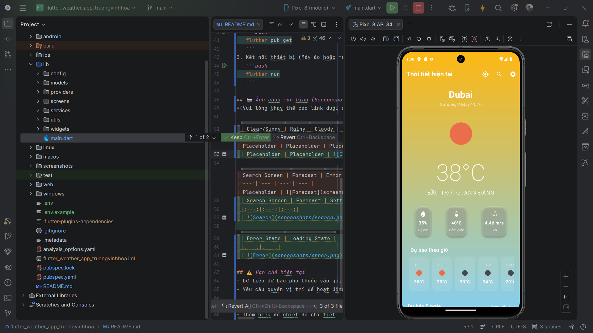
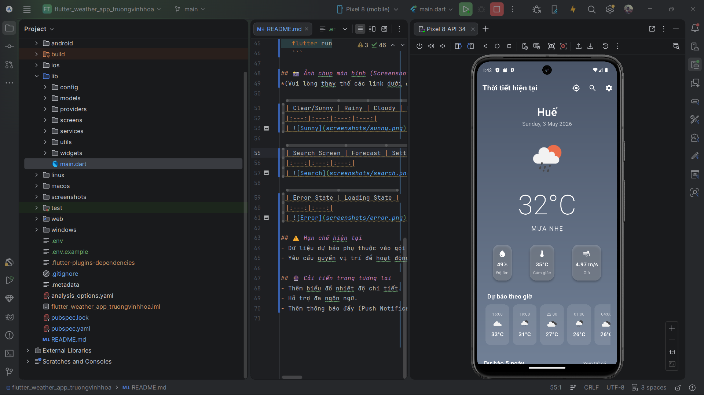
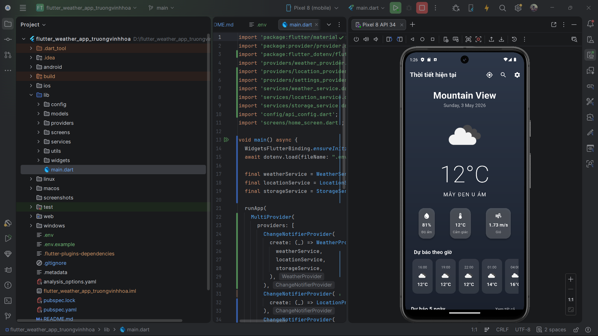
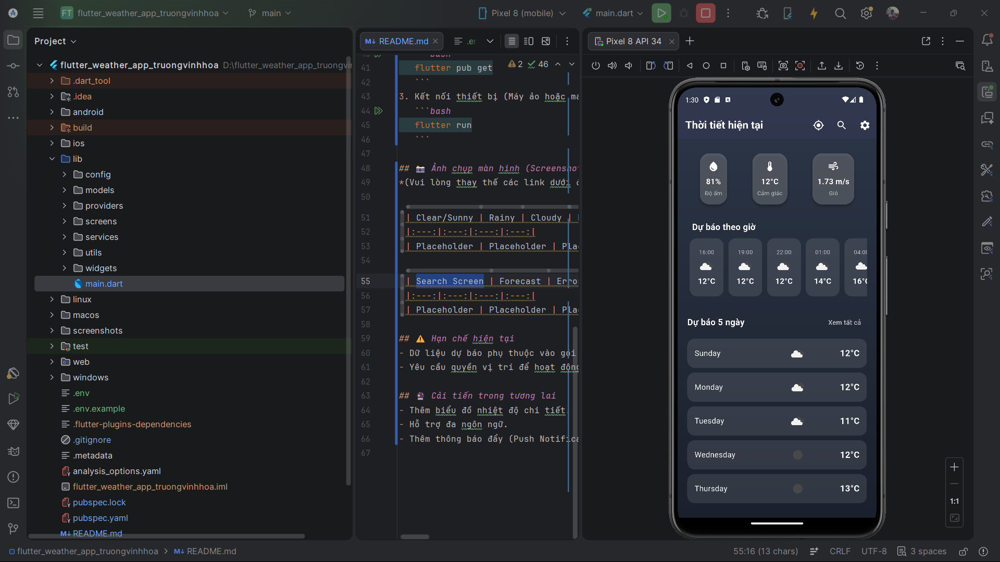
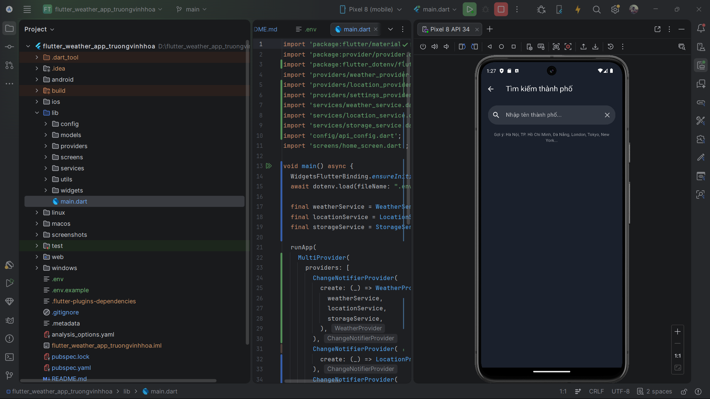
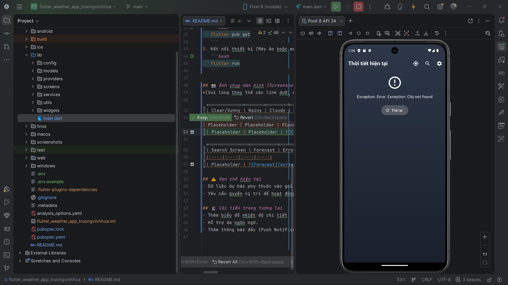
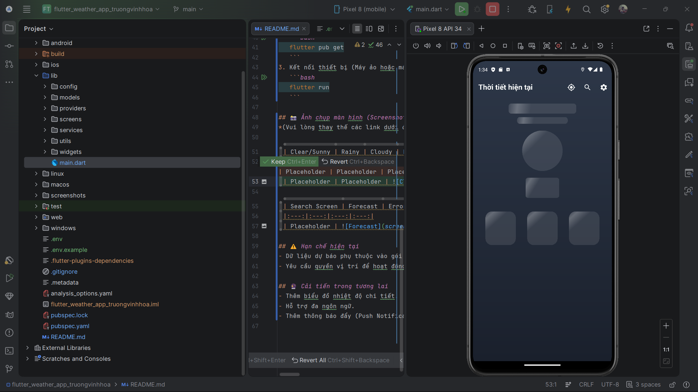

# Flutter Weather App - Trương Vĩnh Hòa

Ứng dụng dự báo thời tiết hiện đại được xây dựng bằng Flutter, cho phép người dùng theo dõi điều kiện thời tiết tại vị trí hiện tại hoặc tìm kiếm bất kỳ thành phố nào trên thế giới.

## ✨ Tính năng chính
- **Dự báo thời tiết thời gian thực**: Cập nhật nhiệt độ, độ ẩm, tốc độ gió và điều kiện bầu trời.
- **Tự động xác định vị trí**: Sử dụng GPS để lấy thông tin thời tiết ngay khi mở app.
- **Tìm kiếm linh hoạt**: Tìm kiếm thời tiết theo tên thành phố.
- **Dự báo 5 ngày**: Xem trước diễn biến thời tiết trong những ngày tới.
- **Giao diện thích ứng**: Hình nền thay đổi theo điều kiện thời tiết (Nắng, Mưa, Mây, Đêm).
- **Chế độ ngoại tuyến**: Xem lại dữ liệu thời tiết đã lưu từ lần truy cập cuối cùng khi không có mạng.

## 🛠 Công nghệ sử dụng
- **Framework**: Flutter & Dart
- **Quản lý trạng thái (State Management)**: `Provider`
- **Kết nối API**: `http`
- **Vị trí & Bản đồ**: `geolocator`, `geocoding`
- **Lưu trữ cục bộ**: `shared_preferences`
- **Quản lý biến môi trường**: `flutter_dotenv`
- **Kiểm tra kết nối**: `connectivity_plus`

## 🚀 Hướng dẫn cài đặt và chạy ứng dụng

### 1. API Setup 
Ứng dụng sử dụng dữ liệu từ OpenWeatherMap.
1. Đăng ký tài khoản miễn phí tại [OpenWeatherMap](https://openweathermap.org/).
2. Lấy API Key từ trang quản lý của bạn.
3. Trong thư mục gốc của dự án, copy file `.env.example` thành `.env`:
   ```bash
   cp .env.example .env
   ```
4. Mở file `.env` và dán API Key của bạn vào:
   ```env
   OPENWEATHER_API_KEY=your_api_key_here
   ```

### 2. Chạy ứng dụng
1. Đảm bảo bạn đã cài đặt Flutter SDK.
2. Chạy lệnh để lấy các gói phụ thuộc:
   ```bash
   flutter pub get
   ```
3. Kết nối thiết bị (Máy ảo hoặc máy thật) và chạy:
   ```bash
   flutter run
   ```

## 🎥 Demo
[Xem Video Demo (Local)](screenshots/video_2224802010812_truongvinhhoa.mp4)

## 📸 Ảnh chụp màn hình (Screenshots)

| Clear/Sunny | Rainy | Cloudy | Night Mode |
|:---:|:---:|:---:|:---:|
|  |  |  |  |

| Search Screen | Forecast | Settings Screen |
|:---:|:---:|:---:|
|  |  |  |

| Error State | Loading State |
|:---:|:---:|
|  |  |

## ⚠️ Hạn chế hiện tại
- Dữ liệu dự báo phụ thuộc vào gói API miễn phí nên có giới hạn số lần gọi.

## 🔮 Cải tiến trong tương lai
- Thêm biểu đồ nhiệt độ chi tiết.
- Hỗ trợ đa ngôn ngữ.

---
**Author**: Trương Vĩnh Hòa
